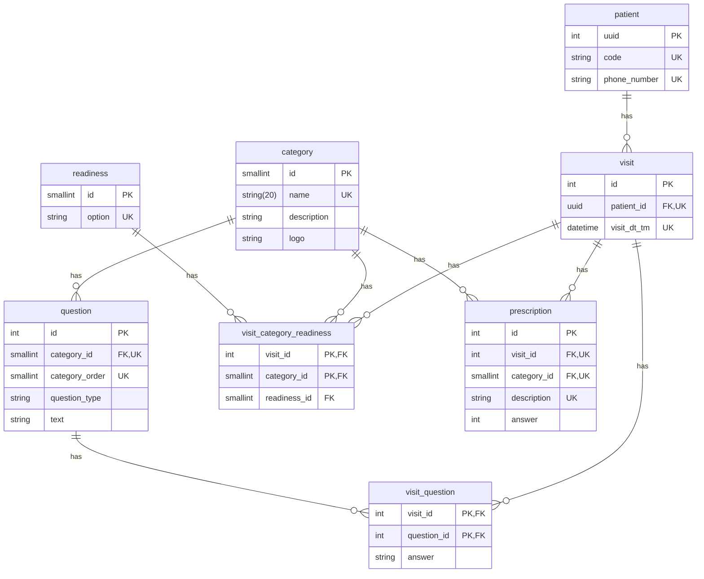

# Web App "Lifestyle Medicine Questionnaire"

## Setup

### Backend

- Verify the environment variables in `.env` file

```env
# DB CONFIG
DB_USER=dba
DB_PASSWORD=dba1234
DB_NAME=med_app
DB_HOST=localhost
DB_PORT=5432

# JWT CONFIG
JWT_SECRET=93ce8d9c77dc615a6ea3fddc

# APP
APP_PORT=5001
APP_URL=http://<IP_ADDRESS>:5173
CORS_ORIGIN=http://<IP_ADDRESS>:5173

# SMS
TWILIO_ACCOUNT_SID=<TWILIO_ACCOUNT_SID>
TWILIO_AUTH_TOKEN=<TWILION_AUTH_TOKEN>
TWILIO_MOBILE_NUMBER=<TEST_NUMBER_THAT_SEND_MESSAGE>
```

#### DB

- Setup the DB if not already done. Below example setting up with docker

```bash
# Pull Postgres image
docker pull postgres
# Run Postgres
docker run --name local_postgres -e POSTGRES_USER=dba -e POSTGRES_PASSWORD=dba1234 -p 5432:5432 -d postgres
```

- Load initial data from the csv files

```bash
# Run all migration files
npx sequelize db:seed:all
# Verify if all were created, for some reason only user and categories are inserted
# To verify, just query the tables. There should be data in each
# Run missing seeders if needed
npx sequelize db:seed --seed '20231204110000-add-categories.js'
npx sequelize db:seed --seed '20231204120000-add-questions.js'
npx sequelize db:seed --seed '20231204130000-add-readiness.js'
npx sequelize db:seed --seed '20231204140000-add-question-mandatory.js'
npx sequelize db:seed --seed '20231204100000-add-admin-user.js'
```

#### App

- Run the backend application once DB has been inserted

```bash
npm run dev
```

### Frontend

- Verify the environment variables in `.env` file

```env
VITE_DOMAIN_API_URL=http://<IP_ADDRESS>:5001
```

- Run the frontend application

```bash
npm run dev
```

## Considerations

- Patient has 1 visit valid for 2 days

- Dependent Questions: if a question depends on the answer of another question to appear, then in questions.csv in column "dependency_questions" the value should be <enabling_answer>|<dependent_question1;dependent_question2;...> (e.g. true|14;15;16)
- Min/max values: if a question has a minimum and maximum values allowed, then in questions.csv in column "min_max" then values should be separated by ; (e.g. 1;7)
- Extra Info: column extra_params has additional info with any of the below values separated with ||

```text
image_name:serves_fruit
min_value:0
max_value:7
subquestion_answer:16_true;17_true
```

e.g. min_value:0||max_value:7

## ER Diagram



